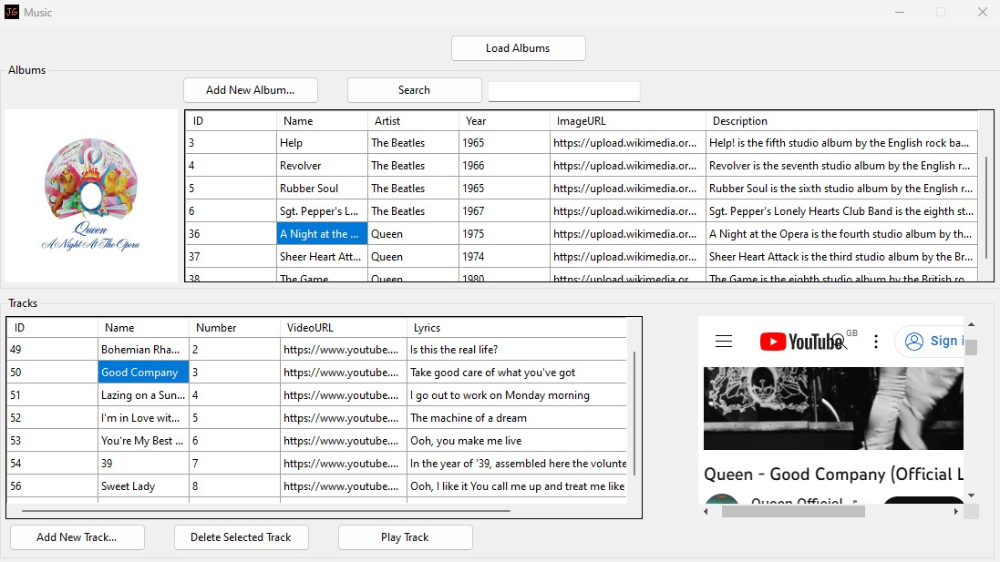

# SQL-MusicDatabase

 WinForms C# front-end and MySQL database back-end to view stored music albums and their associated tracks  
 
 
 
 # Features  
 
 The project uses MAMP to host a local server environment on my machine to then use phpMyAdmin to manage a MySQL database that is stored on my local disk    
 The database is edited through phpMyAdmin and connected and designed in MySQL Workbench  
 Finally, the database is then used in a C# WinForms Visual Studio project to present the data in a Windows application  
 
  
 
 The Windows application can execute mySQL queries to perform read and write operations on the database such as:  
 - Viewing data in a table  
   - View the Album table  
   - View the Track table that has a foriegn key associated with selected Album table  
   
 - Inserting new elements to a table  
   - Insert a new Album into the Album table  
   - Insert a new Track into the Track table with foreign key of selected Album  
   
 - Deleting elements from a table  
   - Delete selected Track  
   
 - Searching through a table to view elements of specified name  
   - Search for a specific Album name

# Tools  

 [**MAMP**](https://www.mamp.info/en/windows/)  
 
 [**phpMyAdmin**](https://www.phpmyadmin.net/)
 
 [**MySQL Workbench**](https://www.mysql.com/products/workbench/)
 
 [**WinForms**](https://learn.microsoft.com/en-us/dotnet/desktop/winforms/?view=netframeworkdesktop-4.8)
 
